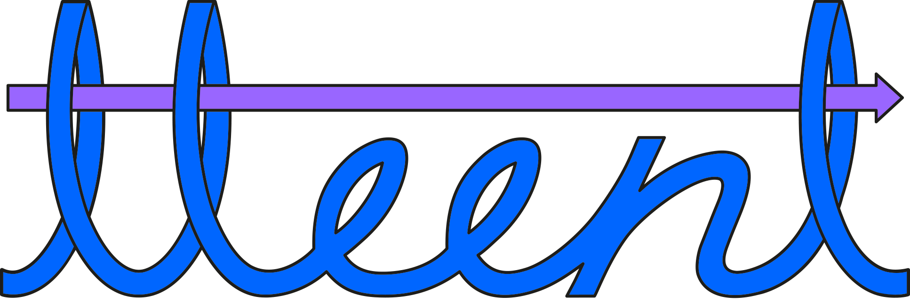

[//]: # (<p align="center"></p>)
<p align="center"></p>

# Meent

[//]: # ([![GitHub license]&#40;https://badgen.net/github/license/Naereen/Strapdown.js&#41;]&#40;https://github.com/Naereen/StrapDown.js/blob/master/LICENSE&#41;)

Meent is an Electromagnetic(EM) simulation package with Python, composed of three main parts:
* Modeling
* EM simulation
* Optimization

## Backends
Meent provides three libraries as a backend:  


* [NumPy](https://github.com/numpy/numpy)
  * The fundamental package for scientific computing with Python
  * Easy and lean to use
* [JAX](https://github.com/google/jax)
  * Autograd and XLA, brought together for high-performance machine learning research.
* [PyTorch](https://github.com/pytorch/pytorch)
  * A Python package that provides two high-level features: Tensor computation with strong GPU acceleration and Deep neural networks built on a tape-based autograd system

### When to use
|                 | Numpy | JAX | PyTorch | Description |
| --------------- | :---: | :-: | :-----: | :---------: |
| 64bit support   |   O   |  O  |    O    | Default for scientific computing |
| 32bit support   |   O   |  O  |    O    | 32bit (float32 and complex64) data type operation* |
| GPU support     |   X   |  O  |    O    | except Eigendecomposition** |
| TPU support*    |   X   |  X  |    X    | Currently there is no workaround to do 32 bit eigendecomposition on TPU |
| AD support      |   X   |  O  |    O    | Automatic Differentiation (Back Propagation) |
| Parallelization |   X   |  O  |    X    | JAX pmap function |

*In 32bit operation, operations on numbers of 8>= digit difference fail without warning or error. 
Use only when you do understand what you are doing.  
**As of now(2023.03.19), GPU-native Eigendecomposition is not implemented in JAX and PyTorch. 
It's enforced to run on CPUs and send back to GPUs.


Numpy is simple and light to use. Suggested as a baseline with small ~ medium scale optics problem.  
JAX and PyTorch is recommended for cases having large scale or optimization part.  
If you want parallelized computing with multiple devices(e.g., GPUs), JAX is ready for that.  
But since JAX does jit compilation, it takes much time at the first run.


## How to install
```shell
pip install meent
```

JAX and PyTorch is needed for advanced utilization.

## How to use

```python
import meent

# backend 0 = Numpy
# backend 1 = JAX
# backend 2 = PyTorch

backend = 1
mee = meent.call_mee(backend=backend, ...)
```
## Tutorials
Jupyter notebooks are prepared in [tutorials](tutorials) to give a brief introduction.

## Examples
Comprehensive examples of computational optics with Meent can be found in `examples` folder.

## Citation
To cite this repository:

```bibtex
@article{kim2024meent,
    title={Meent: Differentiable Electromagnetic Simulator for Machine Learning},
    author={Kim, Yongha and Jung, Anthony W. and Kim, Sanmun and
            Octavian, Kevin and Heo, Doyoung and Park, Chaejin and
            Shin, Jeongmin and Nam, Sunghyun and Park, Chanhyung and
            Park, Juho and Han, Sangjun and Lee, Jinmyoung and
            Kim, Seolho and Jang, Min Seok and Park, Chan Y.},
    journal={arXiv preprint arXiv:2406.12904},
    year={2024}
}
```

[//]: # (### Contact)
[//]: # ([📩 KC-ML2]&#40;mailto:contact@kc-ml2.com&#41;)
