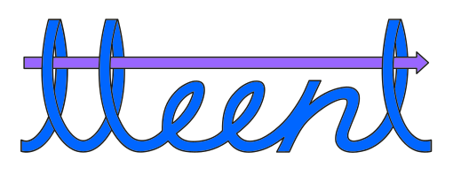

<p align="center"></p>

# Meent

[//]: # ([![GitHub license]&#40;https://badgen.net/github/license/Naereen/Strapdown.js&#41;]&#40;https://github.com/Naereen/StrapDown.js/blob/master/LICENSE&#41;)

Meent is an Electromagnetic(EM) simulation package with Python, composed of three main parts:
* Modeling
* EM simulation
* Optimization

## Backends
Meent provides three libraries as a backend:  


* [NumPy](https://github.com/numpy/numpy)
  * The fundamental package for scientific computing with Python
  * Easy and lean to use
* [JAX](https://github.com/google/jax)
  * Autograd and XLA, brought together for high-performance machine learning research.
* [PyTorch](https://github.com/pytorch/pytorch)
  * A Python package that provides two high-level features: Tensor computation with strong GPU acceleration and Deep neural networks built on a tape-based autograd system

### When to use
|                 | Numpy | JAX | PyTorch | Description |
| --------------- | :---: | :-: | :-----: | :---------: |
| 64bit support   |   O   |  O  |    O    | Default for scientific computing |
| 32bit support   |   O   |  O  |    O    | 32bit (float32 and complex64) data type operation* |
| GPU support     |   X   |  O  |    O    | except Eigendecomposition** |
| TPU support*    |   X   |  X  |    X    | Currently there is no workaround to do 32 bit eigendecomposition on TPU |
| AD support      |   X   |  O  |    O    | Automatic Differentiation (Back Propagation) |
| Parallelization |   X   |  O  |    X    | JAX pmap function |

*In 32bit operation, operations on numbers of 8>= digit difference fail without warning or error. 
Use only when you do understand what you are doing.  
**As of now(2023.03.19), GPU-native Eigendecomposition is not implemented in JAX and PyTorch. 
It's enforced to run on CPUs and send back to GPUs.


Numpy is simple and light to use. Suggested as a baseline with small ~ medium scale optics problem.  
JAX and PyTorch is recommended for cases having large scale or optimization part.  
If you want parallelized computing with multiple devices(e.g., GPUs), JAX is ready for that.  
But since JAX does jit compilation, it takes much time at the first run.


## How to install
```shell
pip install meent
```

JAX and PyTorch is needed for advanced utilization.

## How to use
```python
import meent

# mode 0 = Numpy
# mode 1 = JAX
# mode 2 = PyTorch

mode = 1
mee = meent.call_mee(mode=mode, ...)
```


## Reference

Many literatures and codes are referred for development and quality assurance

[1] https://opg.optica.org/josa/abstract.cfm?uri=josa-71-7-811, Rigorous coupled-wave analysis of planar-grating diffraction \
[2] https://opg.optica.org/josaa/abstract.cfm?uri=josaa-12-5-1068 \
[3] https://opg.optica.org/josaa/abstract.cfm?uri=josaa-12-5-1077 \
[4] https://opg.optica.org/josaa/abstract.cfm?uri=josaa-13-5-1019 \
[5] https://opg.optica.org/josaa/abstract.cfm?uri=josaa-13-4-779 \
[6] https://opg.optica.org/josaa/abstract.cfm?uri=josaa-13-9-1870 \
[7] https://empossible.net/emp5337/ \
[8] https://github.com/zhaonat/Rigorous-Coupled-Wave-Analysis (see also our fork: https://github.com/yonghakim/zhaonat-rcwa) \
[9] https://arxiv.org/abs/2101.00901

[//]: # (### Contact)
[//]: # ([📩 KC-ML2]&#40;mailto:contact@kc-ml2.com&#41;)
