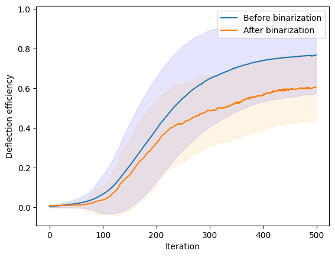
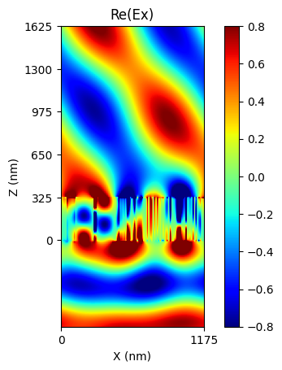
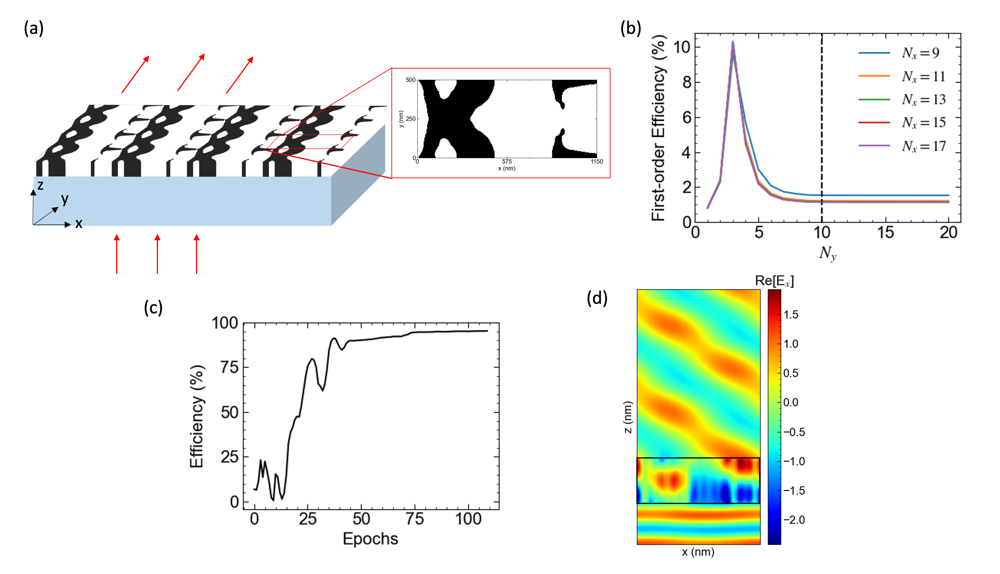

Beam Deflector Optimization
---------------------------
1D
~~~~~~~

|pic1| |pic2|

**Optimization result of 1D beam deflector.** (a) The deflection efficiencies are calculated for every iterations and this experiment is repeated 100 times with random starting points (b) Electric field distribution from the final structure}

In this example, we will optimize 1D beam deflector that was used for benchmark in Chapter \ref{appendix:benchmarks} using AD with these options - 256 cells, FTO $= 100$, $\lambda_0=900$ nm and the deflection angle $= 50^\circ$.
% The device period is divided into 256 cells, FTO of 100 was used, wavelength is 900nm and the deflection angle is set to $50^\circ$.
% The device period is divided into 256 cells  FTO of 100 was used, wavelength is 900nm and the deflection angle is set to $50^\circ$.
% , not 64, to emphasize the impact of gradient on optimization. Based on the results in Fig. \ref{fig:convergence_FTO_sweep}, we find that the forward simulation converges within 1\% of the ground truth value when the Fourier Truncation Order is higher than \~200. Consequently, we fix the Fourier Truncation order to 100 and proceed with the optimization process using the automatic differentiation function provided by Meent.
During the optimization, each cell can have non-binary refractive index values, leading to a gray-scale optimization. To obtain the final structure consisting of only silicon/air binary structures, an additional binary-push process is required.
The initial structure for optimization is randomly generated so the each cell can have the refractive index value between of air and silicon under uniform distribution.
% The initial structure for optimization is randomly generated with the permittivity values at each cell following a uniform distribution [$n_{air}$, $n_{Si}$].
The Figure of Merit for this optimization process is set to the $+1^{st}$ order diffraction efficiency, and the gradient is calculated by AD. The refractive indices are updated over multiple epochs using the ADAM optimizer \cite{kingma2017adam} with the learning rate of 0.5.

% The simulation sequence for analyzing the given structure can be described as follows:
% \lstset{basicstyle=\linespread{1}\selectfont}
% \begin{lstlisting}[language=Python, numbers=left, caption=Example Code to Optimize 1D Beam Deflector]

.. code-block:: python

    # basic Setting
    N_C = 256  # number of pixel / Layer

    backend = 2  # Torch
    device = 0
    pol = 1  # 0: TE, 1: TM

    n_I = 1.45  # n_incidence
    n_II = 1  # n_transmission

    ### Core Parameters ###
    wavelength = 900.
    degree = 50.

    theta = 0 * torch.pi / 180
    # angle of incidence
    phi = 0 * torch.pi / 180
    # angle of rotation

    thickness = torch.tensor([325.])
    # thickness of each layer, from top to bottom.

    period = wavelength / torch.sin(torch.tensor([degree])*torch.pi/180)

    fourier_order = [80]

    type_complex = torch.complex128

    grating_type = 0
    # grating type: 0 for 1D grating without rotation (phi == 0)

    n1 = 1.0
    n2 = 3.45

    ucell_latent = torch.randn(1,1,256)
    ucell_latent.requires_grad = True
    ucell = (n2 - n1) * torch.sigmoid(ucell_latent) + n1

    learning_rate = 0.5
    opt = optim.SGD([ucell_latent],lr = learning_rate)

    mee = meent.call_mee(backend=backend, grating_type=grating_type,
                          pol=pol, n_I=n_I, n_II=n_II, theta=theta,
                          phi=phi, fourier_order=fourier_order,
                          wavelength=wavelength, period=period,
                          ucell=ucell, thickness=thickness, type_complex=type_complex,
                          device=device, fft_type=0, improve_dft=True)

    #optimization process
    for epoch in range(epoches) :

         de_ri, de_ti = mee.conv_solve()
         loss = -de_ti[len(de_ti)//2 - 1]

         loss.backward()
         opt.step()
         opt.zero_grad()
         ucell = (n2 - n1) * torch.sigmoid(ucell_latent * (1 + epoch * 0.02)) + n1
         mee.ucell = ucell

Figure \ref{fig:benchmark optimization curve} shows the deflection
efficiency change by iteration. Two solid lines are averaged value
of all the samples at the same iteration step. Shaded area is marked
with $\pm$ standard deviation from the average.
The blue line (Before binarization) is the result of device with any
real number between two refractive indices (silicon and air), which is
non-practical, and the orange line (After binarization) is the final
device composed of silicon and air. The best result we found is 89.4\%.

2D
~~~~~~~

**Optimization result of 2D beam deflector.**
(a) The schematic of 2D beam deflector and the final structure
after optimization. (b) Convergence test of the initial structure.
(c) Learning curve of structure optimization for 110 epochs.
Spatial blurring and binary push is applied on each epoch
(d) The electric field distribution of the optimized structure
in XZ plane.}

Here, we demonstrate optimization of a 2D diffraction metagrating as shown in Figure \ref{fig:2d_deflector_result}a. Similar to the previous 1D diffraction metagrating, the 2D diffraction metagrating also consists of silicon pillars located on top of a silicon dioxide substrate. TM polarized wave with $\lambda = 1000$ nm is normally incident from the bottom of the substrate and the device is designed to deflect the incident light with deflection angle $\theta = 60^\circ$ in $X$-direction. The device has a rectangular unit cell of period $\lambda/\sin \theta \approx 1150$ nm and $\lambda/2 = 500nm$ for the x and y-axis, respectively. Moreover, the unit cell is gridded into $256 \times 128$ cells which is either filled by air or silicon.
% We set FTO $N_x \neq N_y $ throughout this section as the device is gridded differently for the $x$ and $y$ directions.
The convergence of RCWA simulation for different number of Fourier harmonics are plotted in Figure \ref{fig:2d_deflector_result}b. Considering the trade-off between simulation accuracy and time, we set $N_x = 13$ and $N_y = 10$.
% , and proceed with the optimization using the same configuration as section \ref{sec:1d_grating}. However, in contrast to the previous optimization, the FoM for this case is the deflection efficiency of the (+1, 0) mode only, and the binary push is achieved using a dynamic thresholding sigmoid filter that scales with the epoch.

After 110 epochs of optimization, the final structure achieves an efficiency of 92\% and successfully deflects the incoming beam at a 60$^\circ$ angle (Figure \ref{fig:2d_deflector_result}d). The optimized structure and the learning curve are presented in Figure \ref{fig:2d_deflector_result}a and Figure \ref{fig:2d_deflector_result}c, respectively.
