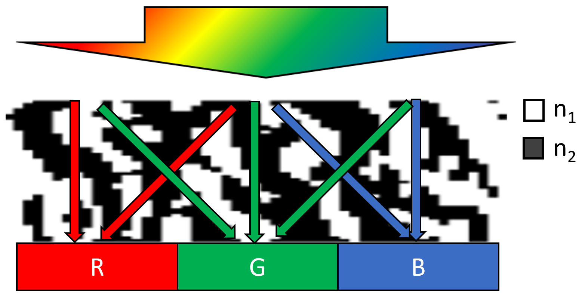
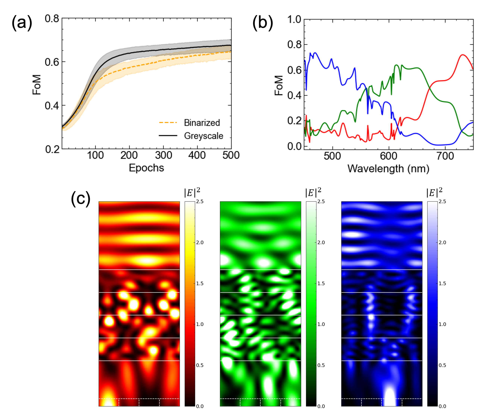

Color Router
------------

**A schematic of a color router.** The incoming light is guided to subpixels of corresponding wavelength.

In this example, we aim to demonstrate the optimization process of a meta color router, which involves a
complex Figure of Merits (FoM).

A meta color router is an optical component designed for next-generation image sensors. It is designed to route
the incoming light to the subpixel region of corresponding color, as depicted in Figure \ref{fig:cf_schematic}.
In this exemplary case, we consider an RGB meta color router featuring a pixel pitch of $0.5\mu m$ that consists of
vertically stacked 1D binary gratings. The constituent dielectrics are silicon dioxide and silicon nitride,
with fixed refractive indices of 1.5 and 2.0, respectively.
The meta device region (width of $1.5\mu m$ and height of $2\mu m$) is sliced into 8 layers with 64 cells per layer.

The FoM for this meta color router is defined as the average of TE mode electric field intensity over the
corresponding subpixel region, as given by Equation \eqref{eqn:cf_fom}.

.. math::
    \begin{align}
        \label{eqn:cf_fom}
        FoM = \frac{1}{N} \sum_{\lambda_1}^{\lambda_N} \frac{\int_{x_1}^{x_2} |\vec{\mathbf{E}}(\lambda)|^2 dx}{\int_{0}^{P} |\vec{\mathbf{E}}(\lambda)|^2 dx}\times T(\lambda)
    \end{align}

Here, :math:`\mathbf E` represents the electric field within the subpixel region, while :math:`T` represents
transmittance. The parameter :math:`x \in (x1,x2)` determines the desired subpixel region corresponding to the
incident beam wavelength. For simplicity, we define the wavelength ranges for R, G, and B as 600 nm - 700 nm,
500 nm - 600 nm, and 400 nm - 500 nm, respectively. Throughout the optimization process, optical efficiencies
are averaged across 9 wavelength points to ensure a finely tuned broadband response.

The optimization procedure for the meta color router follows a similar approach to the previous examples,
including random initialization, optimization via back-propagated gradients with or without binary push.
The optimization curve and the final binarized device structure are shown in Figure \ref{fig:cf_curve}.

**Optimization result of 1D grating meta color router.** (a) Optimization curve of greyscale device and
binary-pushed device at each epoch. (b) Color sorting efficiency spectrum. (c) The electric field inside
the final color router device.

It is important to highlight that optimizing based on local gradients is only feasible when an
automatic differentiation-enabled calculation tool is available. Due to the complexity of the FoM definition,
calculating the FoM gradient through simulation with an adjoint source is not possible.
Some literature attempted to use local gradients obtained from a simulation with an adjoint source.
However, in those cases, the FoM definition was modified to capture only partial aspects of the overall picture.
For example, they focused on maximizing the electric field at the center of the subpixel. Such FoM definitions
do not align with the optimization results obtained when using the complete color sorting efficiency as
the FoM function, as defined in Equation \eqref{eqn:cf_fom}.
