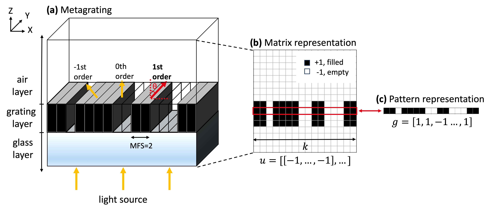

Fourier Neural Operator
=======================

Target
------

Prediction of electric field distribution

We will present the capability of Fourier neural operator (FNO) :cite:`li2020fourier` with
UNet :cite:`ronneberger2015u` as a baseline.

Demo Case
---------

   Figure 1: **Metagrating and its abstract representations.**
   (a) An example of metagrating sized 16 cells, where the grating layer is bounded by air and glass layers.
   The grating pattern periodically repeats along x axis and all layers remains constant along y axis.
   (b) Abstract matrix representation :math:`{\small u\in {\{1, -1\}}^{k\times k}}`, the front view of metagrating.
   (c) Array representation of the grating pattern, :math:`{\small g\in {\{1, -1\}}^{k}}`.

Here we will show FNO within beam deflector of 1 dimensional grating case where the incident light is transverse magnetic
(TM) polarized.

The deflector is arranged in a periodic pattern and used to control the direction of light into
specific angle :math:`\theta` as shown in Figure 1.

At the grating layer, a material is placed on :math:`k` uniform *cells*.

Our figure of merit from the beam deflector include deflection efficiency :math:`\eta \in [0, 1]` and
:math:`x`-component of electric field :math:`\mathbf{E}`.

.. We provide two representative baselines of neural PDE solvers: (a) image-to-image model, UNet :cite:`ronneberger2015u`
.. and (b) operator learning model, Fourier neural operator (FNO) :cite:`li2020fourier`.

Neural PDE solvers
------------------

We provide two approaches of neural PDE solvers: UNet :cite:`ronneberger2015u` which is an image-to-image model,
and Fourier neural operator (FNO) :cite:`li2020fourier`, an operator learning model.

These solvers learn to predict electric field, given a matrix representation of a metagrating.

Our governing PDE that describes electric field distribution can be found from Maxwell's equations:

.. math::
    :name: eqn:maxwell 3

    \begin{align}
        \nabla \times \mathbf E &= -j\omega\mu_0\mathbf H,
    \end{align}

.. math::
    :name: eqn:maxwell 4

    \begin{align}
        \nabla \times \mathbf H &= j\omega\varepsilon_0\varepsilon_r\mathbf E.
    \end{align}

By substituting Equation :ref:`(1) <eqn:maxwell 3>` into Equation :ref:`(2) <eqn:maxwell 4>`,
the governing equation is given as

.. math::
    :name: eqn:pde

    \begin{equation}
        \nabla\times\nabla\times \mathbf{E} = \omega^2 \mu_0 \varepsilon_0 \varepsilon_r \mathbf{E}.
    \end{equation}

In this problem, our focus is on the X-directional component of the electric field, denoted as :math:`v`,
and this is what neural solvers learn to predict.

To use FNO, we need the input and output data pair (u, v) where u is the zero-padded device structure and
v is the field distribution as we just defined.

These are founded by the device pattern.

The device pattern, g, is sampled from uniform distribution,

.. math::
    g=[e_1, ..., e_{k}]\sim \mathrm{Unif}(\{-1, 1\}).

:math:`u` can be made by zero-padding g to have :math:`k\times k` matrix size,
and  :math:`v` is simulated with Meent by solving Equation :ref:`(3) <eqn:pde>` to have the same matrix dimension.

Let :math:`\mathcal{O}` be an operator that maps a function :math:`u(x)` to a function :math:`v(x)` describing
electric field, s.t. :math:`v(x)=\mathcal{O}(u)(x)`.

An approximator of :math:`\mathcal{O}` represented by a neural network is updated using various losses,
and since the solution space of a PDE is highly dependent on physical conditions, we assessed the robustness
of baseline models across nine conditions and collectively report in Appendix \ref{appendix:pde-error}.

Now we try to find O, the operator tha maps u to v.

UNet is a baseline and FNO is benchmarked.

For the training, 10k pair of data is generated for one experimental condition.

(3) We generated 10,000 pairs of :math:`(u,v)` as a training dataset.

And 9 cases were tested.

\begin{figure}[ht]
    \centering
    \begin{subfigure}{0.6\textwidth}
        \centering
        \includegraphics[width=\textwidth, trim= 2 2 2 2, clip]{sections/applications/images/NO-pred.png}
        \caption{Electric field}
        \label{fig:no-prediction}
    \end{subfigure}
    % \hfill
    \begin{subfigure}{0.35\textwidth}
        \centering
        \includegraphics[width=\textwidth, trim= 2 2 2 2, clip]{sections/applications/images/NO-superres.png}
        \caption{Super-resolution}
        \label{fig:no-superres}
    \end{subfigure}
    \caption{
        \textbf{FNO's approximation of Maxwell's equation.}
        (a) Real part of electric field distribution, of ground truth and prediction from FNO.
        (b) Test result on higher resolutions of fields, 512$\times$512 and 1024$\times$1024. The models were trained on 256$\times$256 resolution.
    }
\end{figure}

Fourier Neural Operator
-----------------------

The effectiveness of FNO for solving Maxwell's equation in our metagrating beam deflector is exhibited in Figure 2a.
We follow techniques from \cite{augenstein2023neural}, in which original FNO is adapted to light scattering problem
by applying batch normalization \cite{ioffe2015batch}, adding zero-padding to the input and adopting Gaussian
linear error unit (GELU) activation \cite{hendrycks2016gaussian}.
We further improved FNO's parameter efficiency by applying Tucker factorization \cite{kossaifi2023multi},
where a model's weight matrices are decomposed into smaller matrices for low-rank approximation.
In addition to field prediction capability, we also show zero-shot super-resolution (trained in lower resolution,
tested on higher resolution) capability in Figure \ref{fig:no-superres}, which is claimed to be a major contribution
of FNO \cite{li2023fourier}.

%Super-resolution was tested with the devices transferred to higher resolutions and the corresponding electric fields.

% In our task, FNO trained with $H_1$ loss \cite{czarnecki2017sobolev, son2021sobolev} demonstrated
the best performance.

%The $H_1$ loss, a norm in Sobolev space \cite{czarnecki2017sobolev, son2021sobolev}, promotes smoother solutions
by integrating the norm of the first derivative of target field.

Remarkably, FNO outperformed UNet by a significant margin (76\% lower mean error) with only 1/10 parameters of UNet
when both models were trained with $L_2$ loss, see \ref{appendix:pde-error} for more detail.
The moderate performance of UNet in other PDE solvers \cite{hassan2024bubbleml, augenstein2023neural} contrasts with
its poor performance in our task, which we attribute to its inability to capture detailed structures around
the grating area. More information on model training is provided in Appendix \ref{appendix:pde-training}.
Additionally, in terms of wall time per electric field calculation, FNO required 0.23 seconds for inference,
whereas physical simulation took 0.84 seconds, implying the utility of neural operator as a surrogate EM solver.

----

.. bibliography::
   :filter: docname in docnames

