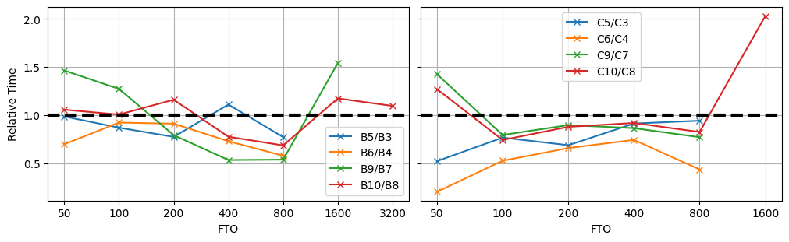

Benchmarks
==========

In this section, we will address the 1D metasurface problem covered in our previous work :cite:`seo2021structural`
with Meent so that we can benchmark and analyze its capability and functionality.

Case Application
----------------

This metagrating deflector is composed of silicon pillars placed on a silica substrate.
The device period is divided into 64 cells, and each cell can be filled with either air or silicon.
The Figure of Merit for this optimization is set to the deflection efficiency of the :math:`+1^{st}` order
transmitted wave when TM polarized wave is normally incident from the silica substrate as in Figure 1.

    Figure 1: **The image of 1D diffraction metagrating on a silicon dioxide substrate.**

Fourier Series Implementation
-----------------------------

Here we will address an effect of sampling frequency in Discrete Fourier series.

As explained, Meent supports two Fourier series methods (DFS and CFS), and DFS takes array as an input.
When the sampling frequency of permittivity distribution is not enough, Fourier coefficients from DFS is aliased.
It can be resolved by increasing the sampling rate that is implemented in the way of duplicating the elements
so the array is extended to have identical distribution but larger array size.
We will call this Enhanced DFS, and it's implemented in Meent as a default option.

It is also possible to use CFS to avoid this issue. But note that AD for CFS in Raster modeling is not supported
since current algorithm has compression step (adopted from Reticolo :cite:`hugonin2021reticolo`)
which loses the calculation chain needed for backpropagation.

|pic1| |pic2|

.. |pic2| image:: images/dfs_hist.png
   :width: 49%
Figure 2: (a) The convergence of RCWA calculations for different Fourier series methods by increasing
FTO while utilizing Raster modeling. (b) Histogram of the difference compared to Reticolo.

Figure 2a illustrates the convergence tests of a particular structure with four different RCWA implementations.
Considering Reticolo as the reference, we can see CFS is well-matched but DFS shows different behavior.
This is due to the insufficient sampling rate of permittivity distribution, which can be resolved by Enhanced DFS.

Figure 2b is the histogram of the discrepancies from Reticolo result. About 600k structures
were evaluated with 4 implementations and the errors of 3 Meent implementations were calculated based
on Reticolo. CFS shows the smallest errors, and this is because Reticolo uses CFS (CFS algorithm in Meent
is adopted from Reticolo). Enhanced DFS decreases the error about three orders of magnitudes
(e.g., the median of DFS is 4.3E-4 and this becomes 1.4E-7).

Python-native
-------------

.. figure:: images/cal_time.png
   :align: center

   Figure 3: **Violin plot of simulation time records.** Precisely, the time for EM solver to return RCWA result to
   running Python process of experiment. Identical structures were simulated with Reticolo and Meent in same
   computational environment. The green line is the time difference between two platforms.

Figure 3 shows the time to get simulation result in main Python process. You can think of it as an RL
environment process calling RCWA process. In the plot, we can see that there exists a constant time
between Meent and Reticolo. This tells us that the time for simulation is roughly in the same scale but additional time
to call MATLAB process is needed.

Computing Performance
---------------------
Meent supports three numerical computation libraries as backends: NumPy, JAX, and PyTorch.
The computational performance evaluated by backend, by architecture (64-bit and 32-bit), and by computing device
(CPU and GPU) are provided as detailed benchmark tests, and result is presented in Table 3.
Here the bottom line is that there is no golden option: it is recommended to conduct
preliminary benchmark tests to find the best configuration before extensive use.

.. list-table:: Table 1: **Hardware Specification.**
   :header-rows: 1

   * -
     - .. centered:: CPU
     - .. centered:: clock
     - .. centered:: # threads
     - .. centered:: GPU
   * - .. centered:: Alpha
     - .. centered:: Intel Xeon Gold 6138
     - .. centered:: 2.00GHz
     - .. centered:: 80
     -
   * - .. centered:: Beta
     - .. centered:: Intel Xeon E5-2650 v4
     - .. centered:: 2.20GHz
     - .. centered:: 48
     - .. centered:: GeForce RTX 2080ti
   * - .. centered:: Gamma
     - .. centered:: Intel Xeon Gold 6226R
     - .. centered:: 2.90GHz
     - .. centered:: 64
     - .. centered:: GeForce RTX 3090

.. list-table:: Table 2: **Test Conditions and IDs.**
   :header-rows: 1

   * - .. centered:: backend
     - .. centered:: device
     - .. centered:: bit
     - .. centered:: alpha server
     - .. centered:: beta server
     - .. centered:: gamma server
   * - .. centered:: NumPy
     - .. centered:: CPU
     - .. centered:: 64
     - .. centered:: (A1)
     - .. centered:: (B1)
     - .. centered:: (C1)
   * - .. centered:: NumPy
     - .. centered:: CPU
     - .. centered:: 32
     - .. centered:: (A2)
     - .. centered:: (B2)
     - .. centered:: (C2)
   * - .. centered:: JAX
     - .. centered:: CPU
     - .. centered:: 64
     - .. centered:: (A3)
     - .. centered:: (B3)
     - .. centered:: (C3)
   * - .. centered:: JAX
     - .. centered:: CPU
     - .. centered:: 32
     - .. centered:: (A4)
     - .. centered:: (B4)
     - .. centered:: (C4)
   * - .. centered:: JAX
     - .. centered:: GPU
     - .. centered:: 64
     -
     - .. centered:: (B5)
     - .. centered:: (C5)
   * - .. centered:: JAX
     - .. centered:: GPU
     - .. centered:: 32
     -
     - .. centered:: (B6)
     - .. centered:: (C6)
   * - .. centered:: PyTorch
     - .. centered:: CPU
     - .. centered:: 64
     - .. centered:: (A7)
     - .. centered:: (B7)
     - .. centered:: (C7)
   * - .. centered:: PyTorch
     - .. centered:: CPU
     - .. centered:: 32
     - .. centered:: (A8)
     - .. centered:: (B8)
     - .. centered:: (C8)
   * - .. centered:: PyTorch
     - .. centered:: GPU
     - .. centered:: 64
     -
     - .. centered:: (B9)
     - .. centered:: (C9)
   * - .. centered:: PyTorch
     - .. centered:: GPU
     - .. centered:: 32
     -
     - .. centered:: (B10)
     - .. centered:: (C10)

Table 1 is the hardware specification of the test server and Table 2 is the index of each test condition.

    Figure 4: **Performance test: calculation time with respect to FTO.**
    Top row is the result from 64bit and bottom
    is from 32bit. The first column is the result from the test server alpha and the rest is beta and gamma in order.

The graphs in Figure 4 are calculation time vs FTO with all the data per machine and
architecture. Before look into the details, we will briefly mention some notice in this figure.
(1) JAX can't afford large FTO regardless of device. We suspect that this is related to JIT compilation which
takes much time and memory for the compilation at the first run. (2) GPU with JAX and PyTorch can't accept
large FTO even though GPU memory is more than needed for array upload. (3) if large amount of calculation is needed,
Numpy or PyTorch on CPU is the option. (4) no golden option exists: it is recommended to find the best option for the
test environment by doing benchmark tests.

We will visit these computing options one by one. The option C9 at FTO 1600 will be excluded in further analyses:
this seems an optimization issue in PyTorch or CUDA.

Backend: NumPy, JAX and PyTorch
~~~~~~~~~~~~~~~~~~~~~~~~~~~~~~~

NumPy, JAX and PyTorch as a backend are benchmarked. NumPy is installed via PyPI which is compiled with OpenBLAS.
There are many types of BLAS libraries and the most representative ones are OpenBLAS and MKL (Math Kernel Library).
As of now, PyPI provides NumPy with OpenBLAS while conda does one with MKL. This makes small discrepancy in terms of
speed and precision hence pay attention when doing consistency test between machines.

    Figure 5: **Performance test by backends.**
    The result is normalized by NumPy case from the same options to compare the behavior of other backends.
    In these plots, black dashed line is :math:`y=1` and the results of NumPy cases lie on this line since they are
    normalized by themselves.

Figure 5 is the relative simulation time per server and architecture normalized by the time of NumPy case
in the same conditions to make comparison easy.

In small FTO regime, all the options were successfully operated and no champion exists. Hence it is strongly
recommended to run benchmark test on your hardware and pick the most efficient one. In case of X7 (A7, B7 and C7),
Alpha and Gamma show the same behavior - spike in 100 - while beta shows fluctuation around B1.
One possible reason for this is the type of CPU. The CPUs of Alpha and Gamma belong to 'Xeon Scalable Processors'
group but Beta is 'Xeon E Processors'. Currently we don't know if this actually makes difference or some other reason
(such as the number of threads or BLAS implementation) does. This result may vary if MKL were used instead of OpenBLAS.

In large FTO, only two options are available: NumPy and PyTorch on CPU in 64 bit. In case of JAX, the tests were failed:
we watched memory occupation surge during the simulation which seems unrelated to matrix calculation. This might be an
issue of JIT (Just In Time) compilation in JAX. Between NumPy and PyTorch, PyTorch is about twice faster than NumPy in
both architectures at Alpha and Gamma, but beta shows different behavior. This too, we don't know the root cause
but one notable difference is the family of CPU type.

Device: CPU and GPU
~~~~~~~~~~~~~~~~~~~

    Figure 6: **Performance test result by device.**
    The calculation time of GPU cases are normalized by CPU cases from the same options to see the efficiency
    of GPU utilization. The left side is the result from beta server and right is from gamma.
    In these plots, black dashed line is :math:`y=1` where the capability of both are the same.

Figure 6 shows the relative simulation time of GPU cases normalized by CPU cases on the same backend and architecture.
Note that it is **relative** time, so the smaller time does not mean it is a good option for the simulation experiments:
the relative time can be small even if the absolute time of CPU and GPU are very large compared to other options.

JAX shows good GPU utilization throughout the whole range (except one point in beta) regardless of the architecture.
Considering the architecture, the data trend in beta is not clear while the gamma clearly shows that GPU utilization
can be more effective in 32bit operation. PyTorch data is a bit noisier than of JAX, but has the similar behavior
per server. The data in beta is hard to conclude as the JAX cases and the gamma too shows ambiguous trend but
we can consider GPU option is efficient with wide range of FTOs.

Up to date, eigendecomposition for non-hermitian matrix which is the most expensive step (:math:`O(M^3N^3)`) in RCWA,
is not implemented on GPU in JAX and PyTorch hence the calculations are done on CPU and the results are sent back
to GPU. As a result, we cannot expect great performance enhancement in using GPUs.

Architecture: 64 and 32 bit
~~~~~~~~~~~~~~~~~~~~~~~~~~~

.. figure:: images/performance/archi.png
    :align: center

    Figure 7: **Performance test result by architecture.** The calculation time of 32bit cases are normalized
    by 64bit cases from the same options. The first column of the figure is the result from alpha server,
    and the rest are beta and gamma.
    In these plots, black dashed line is :math:`y=1` where the capability of both are the same.

In Figure 7, calculation time of 32bit case is normalized by 64bit case with the same condition.
With some exceptions, most points show that simulation in 32bit is faster than 64bit. Here are some important notes:
(1) From our understanding, the eigendecomposition (Eig) in NumPy operates in 64bit regardless of the input type - even
though the input is 32bit data (float32 or complex64), the matrix operations inside Eig are done in 64bit but returns
the results in 32bit data type. This is different from JAX and PyTorch - they provides Eig in 32bit as well as 64bit.
Hence the 32bit NumPy cases in the figure approach to 1 as FTO increases because the calculation time for Eig is
the same and it is the most time-consuming step.
(2) Keep in mind that 32bit data type can handle only 8 digits. This means that 1000 + 0.00001 becomes 1000 without
any warnings or error raises. For such a reason, the accuracy of 32bit cases in the figures are not guaranteed - we
only consider the calculation time.
(3) Eig in PyTorch shows interesting behavior: as FTO increases, calculation time in 32bit overtakes 64bit - see A8/A7,
B8/B7 and C8/C7. This is counter-intuitive and we don't have good explanation but cautiously guess that this might be
related to the accuracy and precision in Eig or an optimization issue of PyTorch.

.. csv-table:: Table 3: **Result of Performance Evaluation Tests.**
   :file: images/performance/benchmark_result.csv
   :header-rows: 1

----

.. bibliography::
   :filter: docname in docnames
