Program Sequence
================

In this section, we will provide a detailed explanation of the functions in Meent and discuss
the simulation program sequence with examples.
Specifically, we will demonstrate an example code for simulating and optimizing the optical response of
a silicon rectangular pillar in a periodic structure.

.. _initialization:
Initialization
--------------

A simple way to use Meent is using ``call_mee()`` function which returns an instance of Python class that includes
all the functionalities of Meent. Simulation conditions can be set by passing parameters as arguements (``args``) or
keyword arguements (``kwargs``) in this function. It is also possible to change conditions after calling instance
by directly assigning desired value to the property of the instance.

Methods to set simulation conditions

.. code-block:: python
   :caption: Code 0. Initialization.

    # method 1: thickness setting in instance call
    mee = meent.call_mee(backend=backend, thickness=thickness, ...)

    # method 2: direct assignment
    mee = meent.call_mee(backend=backend, ...)
    mee.thickness = thickness

Here are the descriptions of the input parameters in Meent class:

``backend`` : **integer**
    supports three backends: NumPy, JAX, and PyTorch.

    * 0: NumPy (RCWA only; AD is not supported).
    * 1: JAX.
    * 2: PyTorch.

``grating_type``  **integer**
    This parameter defines the simulation space.
    
    * 0: 1D grating without conical incidence :math:`(\phi = 0)`.
    * 1: 1D grating with conical incidence.
    * 2: 2D grating.
    
``pol``: **integer** or **float**
    This parameter controls the linear polarization state of the incident wave by this definition: :math:`\psi = \pi / 2 * (1 - {\textit{pol}})`.
    It can take values between 0 and 1. 0 represents fully transverse electric (TE) polarization, and 1 represents fully transverse magnetic (TM) polarization. Support for other polarization states such as the circular polarization state which involves the phase difference between TE and TM polarization will be added in the future updates.

``n_I`` : **float**
    The refractive index of the superstrate.
``n_II`` : **float**
    The refractive index of the substrate.

``theta`` : **float**
    The angle of the incidence in radians.

``phi`` : **float**
    The angle of rotation (or azimuth angle) in radians.

``wavelength`` : **float**
    The wavelength of the incident light in vacuum. Future versions may support complex type wavelength.

``fourier_order`` : **integer** or **list of integers**
    Fourier truncation order (FTO). This represents the number of Fourier harmonics in use.
    If ``fourier_order`` = :math:`N`, this is for 1D grating and Meent utilizes :math:`(2N+1)` harmonics spanning
    from :math:`-N` to :math:`N`::math:`-N, -(N-1), ..., N`. For 2D gratings, it takes a sequence :math:`[M,N]` as
    an input, where :math:`M` and :math:`N` become FTO in :math:`X` and :math:`Y` directions, respectively.
    Note that 1D grating can also be simulated in 2D grating system by setting :math:`N` as :math:`0`.

``period`` : **list of floats**
    The period of a unit cell. For 1D grating, it is a sequence with one element which is a period in X-direction. For 2D gratings, it takes a sequence [period in :math:`X`, period in :math:`Y`] as an input.

``type_complex`` : **integer**
    The datatype used in the simulation.

    * 0: complex128 (64 bit).
    * 1: complex64 (32 bit).

``device`` : **integer**
    The selection of the device for the calculations: currently CPU and GPU are supported. At the time of writing this paper, the eigendecomposition, which is the most expensive step as :math:`\mathcal{O}(M^3N^3)` where :math:`M\text{ and } N` are FTO, is available only on CPU. This means GPU may not as powerful as we expect as in deep learning regime.

    * 0: CPU.
    * 1: GPU.
    * 2: TPU. As of now, TPU is not supported since data transfer between TPU and CPU for eigendecomposition is not enabled.

``fft_type`` : **integer**
    This variable selects the type of Fourier series implementation. 0 and 1 are options for raster modeling and 2 is for vector modeling. 0 uses discrete Fourier series (DFS) while 1 and 2 use continuous Fourier series (CFS). Note that the name `fft\_type' may change since it is not correct expression.

    * 0: DFS for the raster modeling (pixel-based geometry).
        ``fft_type`` supports ``improve_dft`` option, which is
        True by default, that can prevent aliasing by increasing sampling frequency, and drives the result to approach
        to the result of CFS.

    * 1: CFS for the raster modeling (pixel-based geometry).
        This doesn't support backpropagation. Use this option for debugging or in RCWA-only situation.

    * 2: CFS for the vector modeling (object-based geometry).

``thickness`` : **list of floats**
    The sequence of the thickness of each layer from top to bottom.

``ucell`` : **array of \{floats, complex numbers\}, shape is (i, j, k)**
    The input for the raster modeling. It takes a 3D array in (:math:`Z`, :math:`Y`, :math:`X`) order, where :math:`Z` represents the direction of the layer stacking. In case of 1D grating, j is 1 (e.g., shape = (3,1,10) for a stack composed of 3 layers that are 1D grating).

Geometry Modeling
-----------------
Meent provides two types of geometry modeling methods: raster and vector.

Raster Modeling
~~~~~~~~~~~~~~~

|pic5| |pic6|

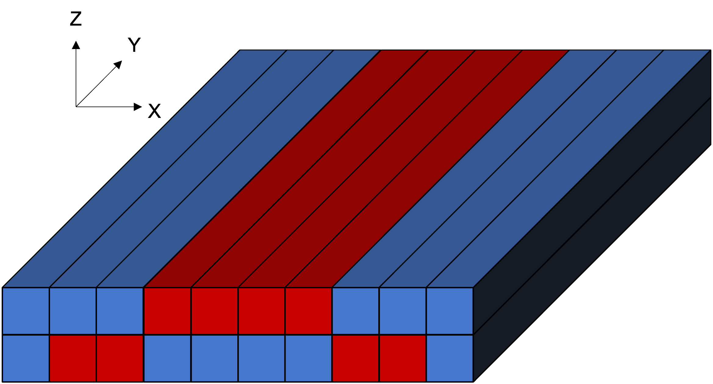

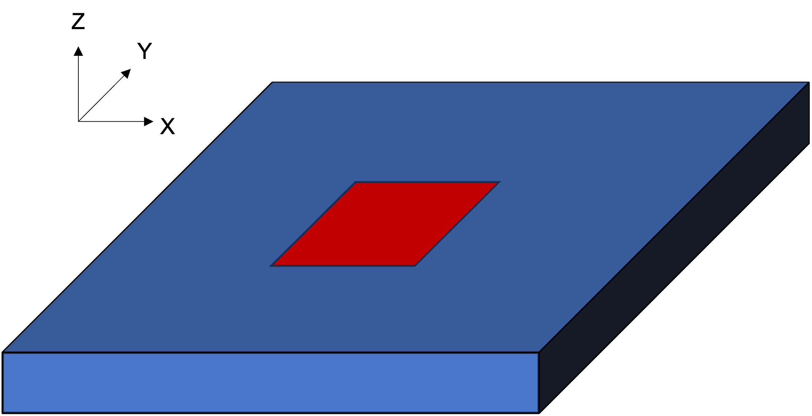
Figure 1: **Raster-type structure examples.** (a) 2 layers in 1D and (b) 1 layer in 2D grating.

.. code-block:: python
   :caption: Code 1. Raster modeling.

    # (a): 1D grating with 2 layers
    ucell = np.array(
        [
            [[1, 1, 1, 3.48, 3.48, 3.48, 3.48, 1, 1, 1]],
            [[1, 3.48, 3.48, 1, 1, 1, 1, 3.48, 3.48, 1]],
        ])   # array shape: (2, 1, 10)

    # (b): 2D grating with 1 layers
    ucell = np.array(
        [[
                [1, 1, 1, 1, 1, 1, 1, 1, 1, 1],
                [1, 1, 1, 3.48, 3.48, 3.48, 3.48, 1, 1, 1],
                [1, 1, 1, 3.48, 3.48, 3.48, 3.48, 1, 1, 1],
                [1, 1, 1, 3.48, 3.48, 3.48, 3.48, 1, 1, 1],
                [1, 1, 1, 3.48, 3.48, 3.48, 3.48, 1, 1, 1],
                [1, 1, 1, 3.48, 3.48, 3.48, 3.48, 1, 1, 1],
                [1, 1, 1, 1, 1, 1, 1, 1, 1, 1],
                [1, 1, 1, 1, 1, 1, 1, 1, 1, 1],
            ]])  # array shape: (1, 8, 10)

    mee = meent.call_mee(backend=backend, ucell=ucell)

We have 2 example structures of raster modeling as shown in Figure 1 and Code 1.
Figure 1a is a stack of 2 layers which has 1D grating. Note that 1D grating unit cell can be defined by setting
the length of the second axis to 1 as (a) in Code 1.
Figure 1b is a stack of single 2D grating layer.

Vector Modeling
~~~~~~~~~~~~~~~
|pic1| |pic2|

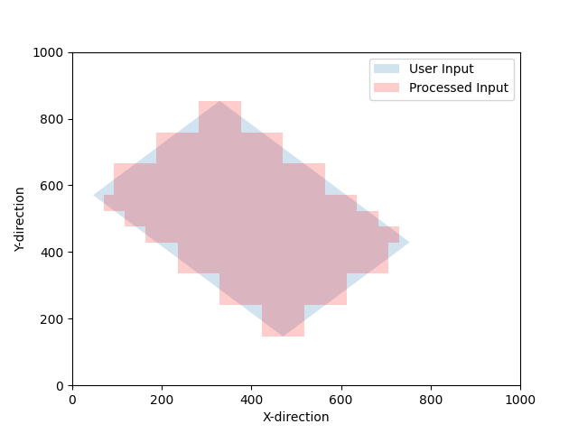

Figure 2: **Rotated rectangles with approximation.** Light blue is the ideal one and light red is approximated one.

.. code-block:: python
   :caption: Code 2. Rotated rectangle in vector modeling.

    thickness = [300.]
    length_x = 100
    length_y = 300
    center = [300, 500]
    n_index_1 = 3.48
    n_index_2 = 1
    base_n_index_of_layer = n_index_2
    angle = 35 * torch.pi / 180
    n_split = [5, 5]  # degree of approximation

    length_x = torch.tensor(length_x, dtype=torch.float64, requires_grad=True)
    length_y = torch.tensor(length_y, dtype=torch.float64, requires_grad=True)
    thickness = torch.tensor(thickness, requires_grad=True)
    angle = torch.tensor(angle, requires_grad=True)

    obj_list = mee.rectangle_rotate(*center, length_x, length_y, *n_split, n_index_1, angle)
    layer_info_list = [[base_n_index_of_layer, obj_list]]
    mee.draw(layer_info_list)

Figure 2 shows rotated rectangles drawn on XY plane. Meent decomposes the geometrical figures into the collection
of sub-rectangles which of each side lies on the direction of either :math:`\hat x` or :math:`\hat y`.
Then CFS with the sinc function is used to find the Fourier coefficients. The degree of approximation can be
determined by ``n_split`` option in Code 2.

To add primitives to the simulation space, users can utilize `rectangle()' or `rectangle_rotation()' functions
which allows the insertion of desired geometry. The `draw()' function is then employed to create the
final structure, taking into account any potential overlaps between the geometries. Code \ref{code:vector}
is the example creating a layer that has rotated rectangle.

|pic3| |pic4|

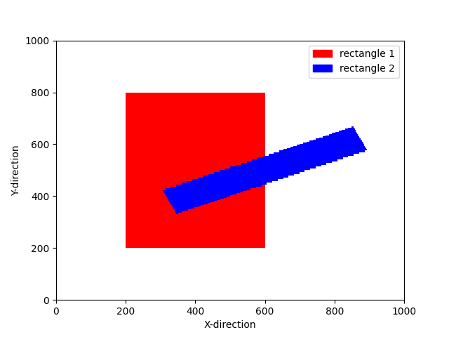

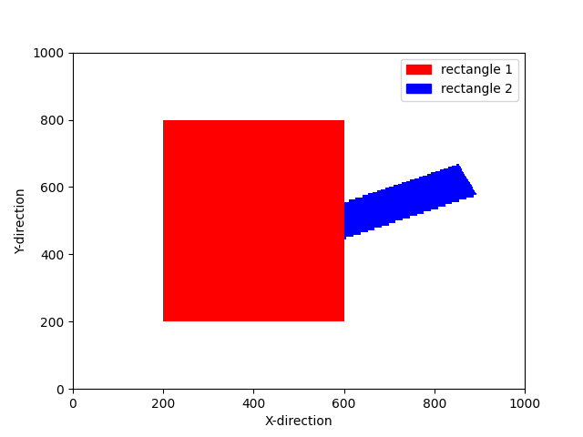
Figure 3: **The overlap of 2 rectangles in vector modeling.** The hierarchy is determined
by the index of the objects in the list.

.. code-block:: python
   :caption: Code 3. Overlap in vector modeling.

    red_rect = mee.rectangle_rotate(*[400, 500], 400, 600, 20, 20, 3.5, 0)
    blue_rect = mee.rectangle_rotate(*[600, 500], 100, 600, 40, 40, 10, -20)

    layer_info_list = [[2.4, red_rect + blue_rect]]  # red bottom, blue top
    layer_info_list = [[2.4, blue_rect + red_rect]]  # blue bottom, red top

    mee.draw(layer_info_list)
    de_ri, de_ti = mee.conv_solve()

Code 3 and Figure 3 show how Meent can handle the overlap of the shapes.
Figure 3a and 3b have the same set of rectangles (red and blue) but they are placed
in different order and this can be controlled by the argument ``layer_info_list`` in Code 3.
It is the list that contains the base refractive index of the layer and the primitive shapes to be placed on the layer.
In case of Figure 3a, red rectangle comes first in the list and blue does for Figure 3b.

Electromagnetic Simulation
--------------------------

.. code-block:: python
   :caption: Code 4: Method call for EM simulation.

    mee = call_mee(backend, ...)

    # generates convolution matrix and solves Maxwell's equation.
    de_ri, de_ti = mee.conv_solve()

    # generates convolution matrix, solves Maxwell's equation and
    # reconstructs field distribution.
    de_ri, de_ti, field_cell = mee.conv_solve_field()

Electromagnetic simulation (EM simulation) in Meent can be divided into 3 main subcategories:
convolution matrix generation, Maxwell's equations computation and field calculation.
The method ``conv_solve()`` does both convolution matrix generation and Maxwell's equations
computation sequentially. ``conv_solve_field()`` method does the same and additionally calculates
the field distribution of the structure. Code \ref{code:em_method} is the example showing
how to use those; ``conv_solve()`` method returns the reflected and transmitted diffraction
efficiencies and ``conv_solve_field()`` does both and field distribution.

Convolution Matrix Generation
~~~~~~~~~~~~~~~~~~~~~~~~~~~~~
|pic7| |pic8|

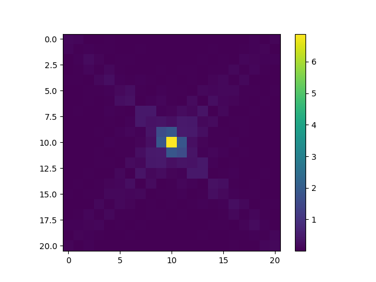

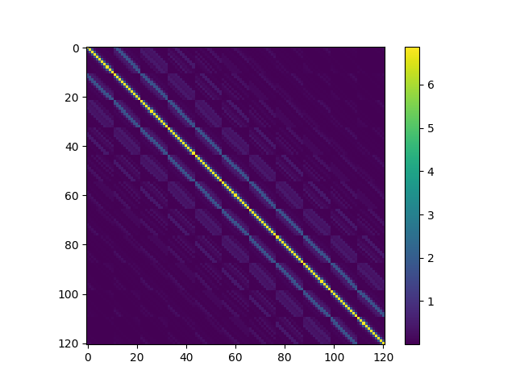
Figure 4: **Material property in Fourier space.** (a) Coefficients matrix of Fourier analysis and
(b) convolution matrix generated by re-arranging (circulant matrix) Fourier coefficients.

.. code-block:: python
   :caption: Code 5: ``conv_solve()``.

    def conv_solve(self, **kwargs):
        [setattr(self, k, v) for k, v in kwargs.items()]
        # needed for optimization

        if self.fft_type == 0:  # raster with DFS
            E_conv_all, o_E_conv_all = to_conv_mat_raster_discrete(self.ucell, self.fourier_order[0], self.fourier_order[1], device=self.device, type_complex=self.type_complex, improve_dft=self.improve_dft)

        elif self.fft_type == 1:  # raster with CFS
            E_conv_all, o_E_conv_all = to_conv_mat_raster_continuous(self.ucell, self.fourier_order[0], self.fourier_order[1], device=self.device, type_complex=self.type_complex)

        elif self.fft_type == 2:  # vector with CFS
            E_conv_all, o_E_conv_all = to_conv_mat_vector(self.ucell_info_list, self.fourier_order[0], self.fourier_order[1], type_complex=self.type_complex)

        else:
            raise ValueError

        de_ri, de_ti, layer_info_list, T1, kx_vector = self._solve(self.wavelength, E_conv_all, o_E_conv_all)

        self.layer_info_list = layer_info_list
        self.T1 = T1
        self.kx_vector = kx_vector

        return de_ri, de_ti

The functions for convolution matrix generation are located in ``convolution_matrix.py`` file for each backend.
This part transforms the structure from the real space to the Fourier space and returns a convolution matrix
(also called Toeplitz matrix) of the Fourier coefficients to apply convolution operation with the E and H fields.
Figure 4 shows the Fourier coefficients matrix and convolution matrix
made from the coefficient matrix.
Code 5 is the definition of ``conv_solve()`` method and shows how the convolution matrix generation
is integrated inside. As shown in the code, Meent offers 3 different methods to get convolution matrix since
each method has different input type and implementation. This can be chosen by the argument ``fft_type``: 0 is for
raster modeling with DFS, 1 for raster with CFS and 2 for vector with CFS.

Maxwell's Equations Computation
~~~~~~~~~~~~~~~~~~~~~~~~~~~~~~~

.. code-block:: python
   :caption: Code 6: ``solve()``.

    def solve(self, wavelength, e_conv_all, o_e_conv_all):
        de_ri, de_ti, layer_info_list, T1, kx_vector = self._solve(wavelength, e_conv_all, o_e_conv_all)

        # internal info. for the field calculation
        self.layer_info_list = layer_info_list
        self.T1 = T1
        self.kx_vector = kx_vector

        return de_ri, de_ti

``wavelength`` : **float**
    The wavelength of the incident light in vacuum.
``e_conv_all`` : **array of {float or complex}**
    A stack of convolution matrices of the permittivity array;
    this is :math:`\left[\!\!\left[\varepsilon_{r,g}^{}\right]\!\!\right]` in Background theory.
    The order of the axes is the same as of ucell (:math:`Z, Y, X`).

``o_e_conv_all`` : **array of {float or complex}**
    A stack of convolution matrices of the one-over-permittivity array;
    this is :math:`\left[\!\!\left[\varepsilon_{r,g}^{-1}\right]\!\!\right]` in Background theory.
    The order of the axes is the same as of ucell (:math:`Z, Y, X`).

After generating the convolution matrix, Meent solves Maxwell's equations
and returns diffraction efficiencies with the method ``solve()``. As in the Code 6,
it is a wrapper of ``_solve()`` method that actually does the calculations and returns
the diffraction efficiencies with other information that is necessary for the field calculation.

The diffraction efficiencies are 1D array for 1D and 1D-conical grating and 2D for 2D grating.

Field Calculation
~~~~~~~~~~~~~~~~~

|pic9| |pic10| |pic11| |pic12| |pic13| |pic14|

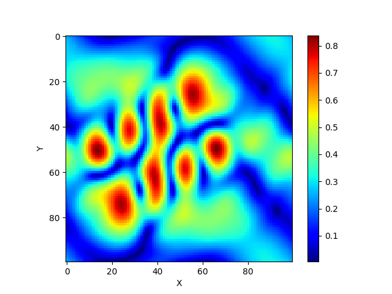

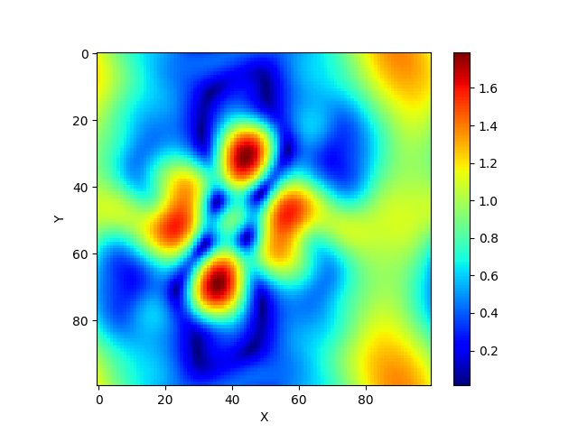

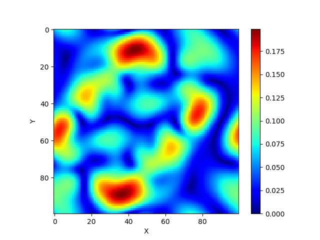

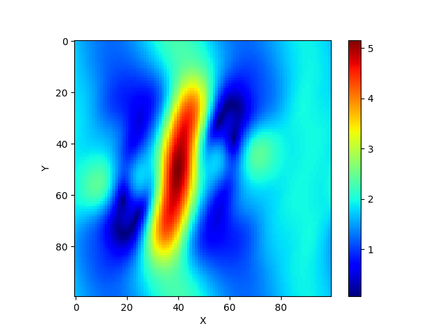

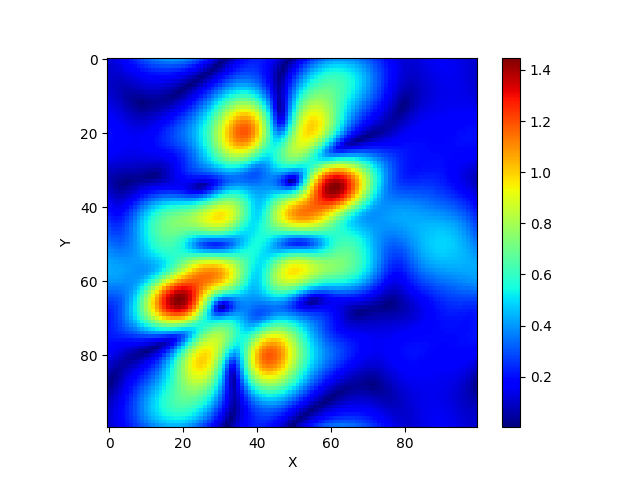

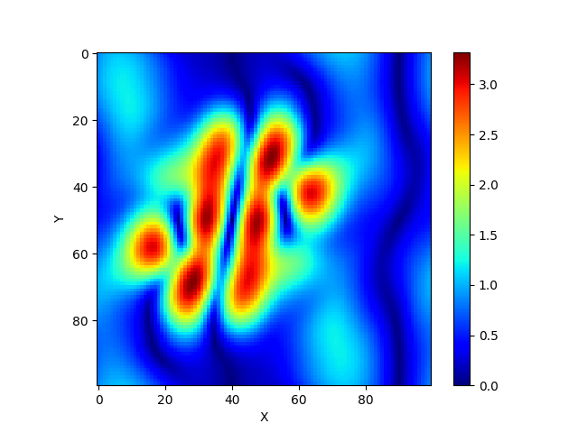

Figure 5: **Field distribution on XY plane from 2D grating structure.**  (a)-(c): absolute value of the electric field
in each direction, (d)-(f): absolute value of the magnetic field in each direction.

.. code-block:: python
   :caption: Code 7: ``calculate_field()``.

    field_cell = mee.calculate_field(res_x=100, res_y=100, res_z=100)

``res_x`` : **integer**
    The field resolution in X direction (number of split which the period of x is divided by).

``res_y`` : **integer**
    The field resolution in Y direction (number of split which the period of y is divided by).

``res_z`` : **integer**
    The field resolution in Z direction (number of split in thickness of each layer).

``field_algo`` : **integer**
    The level of vectorization for the field calculation. Default is 2 which is fully vectorized for fast calculation while 1 is half-vectorized and 0 is none. Option 0 and 1 are remained for debugging or future development (such as parallelization).

    * 0: Non-vectorized
    * 1: Semi-vectorized: in X and Y direction
    * 2: Vectorized: in X, Y and Z direction

.. code-block:: python
   :caption: Code 8: the shape of returned array from ``calculate_field()``.

    # 1D TE and TM case
    field_cell = torch.zeros((res_z * len(layer_info_list), res_y, res_x, 3), dtype=type_complex)

    # 1D conincal and 2D case
    field_cell = torch.zeros((res_z * len(layer_info_list), res_y, res_x, 6), dtype=type_complex)

The ``calculate_field()`` method in Code 7 calculates the field distribution inside the
structure. Note that the ``solve()`` method must be preceded.
This function returns 4 dimensional array that the length of the last axis varies depending on the grating type
as shown in Code 8. 1D TE and TM has 3 elements (TE has Ey, Hx and Hz in order and TM has Hy, Ex and Ez)
while the others have 6 elements (Ex, Ey, Ez, Hx, Hy and Hz) as in Figure 5.

----

.. bibliography::
   :filter: docname in docnames
