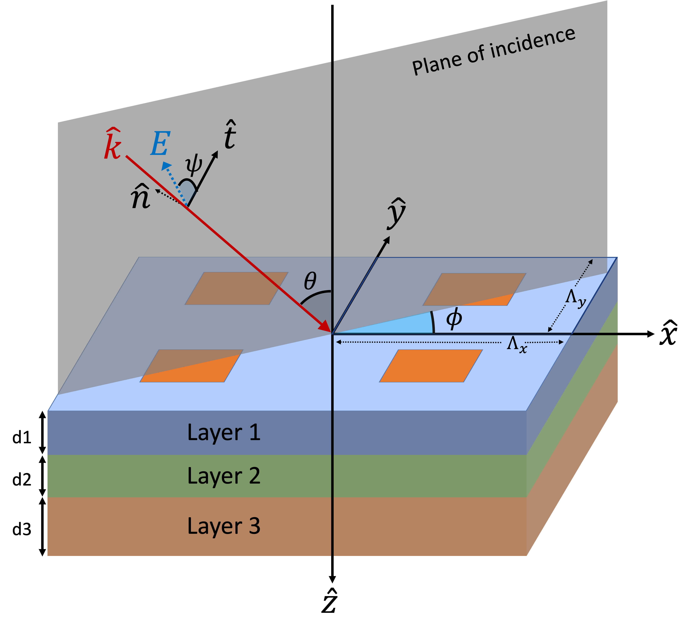

Eigenmodes Identification
=========================

Once the permittivity distribution is mapped to the Fourier space, the next step is to apply Maxwell's equations
to identify the eigenmodes of each layer.
In this section, we extend the mathematical formulation of the 1D conical incidence case described in
:cite:`Moharam:95-formulation` to the 2D grating case as illustrated in Figure 1.
To ensure the consistency and clarity, we adopt the same notations and the sign convention of :math:`(+jwt)`.

We consider the normalized excitation wave at the superstrate to take the following form:

    Figure 1: **Geometry for the stack.** Two-dimensional grating layers and incident ray.

.. math::
    :name: eqn:E-define

    \begin{align}
        \mathbf E_{inc} = \mathbf u \cdot e^{-jk_0\mathtt n_{\text{I}}(\sin{\theta} \cdot \cos{\phi}\cdot x +
        \sin{\theta}\cdot \sin{\phi}\cdot y + \cos{\theta}\cdot z)},
    \end{align}

where $\mathbf u$ is the normalized amplitudes of the wave in each direction:

.. math::
    :name: eqn:u-define

    \begin{align}
        \mathbf{u} = (\cos{\psi}\cdot \cos{\theta}\cdot\cos{\phi} + \sin{\psi}\cdot\sin{\phi}) \hat{x}
        + (\cos{\psi}\cdot\cos{\theta}\cdot\sin{\phi} + \sin{\psi}\cdot\cos{\phi})\hat{y}
        + (\cos{\psi}\cdot\sin{\theta})\hat{z},
    \end{align}

and :math:`k_0 = 2\pi / \lambda_0` with :math:`\lambda_0` the wavelength of the light in free space,
:math:`\mathtt n_{\text{I}}` is the refractive index of the superstrate, :math:`\theta` is the angle of incidence,
:math:`\phi` is the rotation (azimuth) angle and :math:`\psi` is the angle between the electric field vector and
the plane of incidence.

The electric fields in the superstrate and substrate (we will designate these layers by :math:`\text{I}` and
:math:`\text{II}` as in :cite:`Moharam:95-formulation`) can be expressed as a sum of incident,
reflected and transmitted waves as the Rayleigh expansion :cite:`rayleigh, Electromagnetic-theory-of-gratings, rayleigh-expansion`:

.. math::
    :name: eqn:incidence

    \begin{align}
        \mathbf{E}_{\text{I}} &= \mathbf{E}_{inc} + \sum_{m=-M}^{M} \sum_{n=-N}^{N} \mathbf{R}_{n,m}
        e^{-j(k_{x,m} x + k_{y,n} y - k_{\text{I}, z,(n,m)}z)},
    \end{align}

.. math::
    :name: eqn:terminal

    \begin{align}
        \mathbf{E}_{\text{II}} &= \sum_{m=-M}^{M} \sum_{n=-N}^{N} \mathbf{T}_{n,m}e^{-j\{k_{x,m} x + k_{y,n} y
        + k_{\text{II}, z,(n,m)} (z-d)\}},
    \end{align}

where :math:`M` and :math:`N` are the Fourier Truncation Order (FTO) which is related to the number of harmonics in use,
and the in-plane components of the wavevector (:math:`k_{x,m}` and :math:`k_{y,n}`) are determined by the Bloch's
theorem (this has many names and one of them is Floquet condition) :cite:`floquet-bloch, photonic-crystal`,

.. math::

    \begin{align}
        k_{x,m} &= k_0 \Big(\mathtt n_{\text{I}} \sin{\theta}\cos{\phi} - m\frac{\lambda_0}{\Lambda_x}\Big), \\
        k_{y,n} &= k_0 \Big(\mathtt n_{\text{I}} \sin{\theta}\sin{\phi} - n\frac{\lambda_0}{\Lambda_y}\Big),
    \end{align}

where :math:`\Lambda_x` and :math:`\Lambda_y` are the period of the unit cell, and the out-of-plane wavevector
is determined from the dispersion relation:

.. math::

    \begin{align}
        k_{\ell,z,(n,m)} =
        \begin{cases}
            +\ [(k_0\mathtt n_\ell)^2 - {k_{x,m}}^2 - {k_{y,n}}^2]^{1/2}&, \quad \text{if}\quad ({k_{x,m}}^2
            + {k_{y,n}}^2) < (k_0\mathtt n_\ell)^2 \\
            -j[{k_{x,m}}^2 + {k_{y,n}}^2 - (k_0\mathtt n_\ell)^2]^{1/2}&, \quad \text{if}\quad ({k_{x,m}}^2
            + {k_{y,n}}^2) > (k_0\mathtt n_\ell)^2
        \end{cases}, \quad
        \ell = \text{I}, \text{II}.
    \end{align}

Here, :math:`k_{\ell,z,(n,m)}` can be categorized into propagation mode and evanescent mode depending on
whether it's real or imaginary. :math:`\mathbf R_{n,m} \text{ and } \mathbf T_{n,m}` are the Rayleigh coefficients
(also called the reflection and transmission coefficients):  :math:`\mathbf{R}_{n,m}` is the normalized (3-dimensional)
vector of electric field amplitude which is the (:math:`m^{th}` in X and :math:`n^{th}` in Y) mode of reflected waves
in the superstrate and :math:`\mathbf{T}_{n,m}` is the normalized (3-dimensional) vector of electric field amplitude
which is the (:math:`m^{th}` in X and :math:`n^{th}` in Y) mode of transmitted waves in the substrate.

Inside the grating layer, the electromagnetic field can be expressed as a superposition of plane waves
by the Bloch's theorem:

.. math::
    :name: eqn:Eg-curly S

    \begin{align}
        \mathbf{E}_{g}(x,y,z) &= \sum_{m=-M}^{M} \sum_{n=-N}^{N} \boldsymbol{\mathfrak{S}}_{g,(n,m)}
        \cdot e^{-j(k_{x,m}x + k_{y,n}y + k_{g,z}z)}, \\
    \end{align}

.. math::
    :name: eqn:Hg-curly U

    \begin{align}
        \mathbf{H}_{g}(x,y,z) &= \sum_{m=-M}^{M} \sum_{n=-N}^{N} \boldsymbol{\mathfrak{U}}_{g,(n,m)}
        \cdot e^{-j(k_{x,m}x + k_{y,n}y + k_{g,z}z)},
    \end{align}

where :math:`k_{g,z}` is the wavevector in Z-direction (this is unique per layer hence the notation g was kept
to distinguish) and :math:`\boldsymbol{\mathfrak{S}}_{g,(n,m)}` and :math:`\boldsymbol{\mathfrak{U}}_{g,(n,m)}`
are the vectors of amplitudes in each direction at :math:`(m, n)^{th}` order:

.. math::

    \begin{align}
        \boldsymbol{\mathfrak{S}}_{g,(n,m)} &= \mathfrak{S}_{g,(n,m), x}\ \hat x + \mathfrak{S}_{g,(n,m), y}\ \hat y
        + \mathfrak{S}_{g,z}\ \hat z, \\
        \boldsymbol{\mathfrak{U}}_{g,(n,m)} &= \mathfrak{U}_{g,(n,m), x}\ \hat x + \mathfrak{U}_{g,(n,m), y}\ \hat y
        + \mathfrak{U}_{g,z}\ \hat z.
    \end{align}

It is also possible to detach wavevector term on :math:`z` from exponent and combine
with :math:`\mathbf{\mathfrak{S}}_{g,(n,m)}` and :math:`\mathbf{\mathfrak{U}}_{g,(n,m)}`
in Equations :ref:`(5) <eqn:Eg-curly S>` and :ref:`(6) <eqn:Hg-curly U>` to make :math:`\mathbf{S}_{g,(n,m)}(z)`
and :math:`\mathbf{U}_{g,(n,m)}(z)` which are dependent on :math:`z` as shown below:

.. math::
    :name: eqn:S to S(z)

    \begin{align}
        \mathbf{S}_{g,(n,m)}(z) = \boldsymbol{\mathfrak{S}}_{g,(n,m)} \cdot e^{-jk_{g,z}z}, \\
    \end{align}

.. math::
    :name: eqn:U to U(z)

    \begin{align}
        \mathbf{U}_{g,(n,m)}(z) = \boldsymbol{\mathfrak{U}}_{g,(n,m)} \cdot e^{-jk_{g,z}z},
    \end{align}

then Equations :ref:`(5) <eqn:Eg-curly S>` and :ref:`(6) <eqn:Hg-curly U>` become

.. math::
    :name: eqn:Eg-Sg(z)

    \begin{align}
        \mathbf{E}_{g}(x,y,z) &= \sum_{m=-M}^{M} \sum_{n=-N}^{N} \mathbf{S}_{g,(n,m)}(z)
        \cdot e^{-j(k_{x,m}x + k_{y,n}y)}, \\
    \end{align}

.. math::
    :name: eqn:Hg-Ug(z)

    \begin{align}
        \mathbf{H}_{g}(x,y,z) &= \sum_{m=-M}^{M} \sum_{n=-N}^{N} \mathbf{U}_{g,(n,m)}(z)
        \cdot e^{-j(k_{x,m}x + k_{y,n}y)}.
    \end{align}

Equations :ref:`(5) <eqn:Eg-curly S>` and :ref:`(6) <eqn:Hg-curly U>` are used in :cite:`liu2012s4, yoon2021maxim, kim2023torcwa`
and Equations :ref:`(9) <eqn:Eg-Sg(z)>` and :ref:`(10) <eqn:Hg-Ug(z)>` in :cite:`Moharam:95-formulation, rumpf-dissertation`.
Whichever is used, the result is the same: we will show the development using
(:math:`\boldsymbol{\mathfrak{S}}_{g,(n,m)}`, :math:`\boldsymbol{\mathfrak{U}}_{g,(n,m)}`) with the eigendecomposition
and then come back to (:math:`\mathbf{S}_{g,(n,m)}(z)` and :math:`\mathbf{U}_{g,(n,m)}(z)`)
with the partial differential equations.

The behavior of the electromagnetic fields can be described by the formulae, called the Maxwell's equations.
Among them, we will use the third and fourth equations,

.. math::
    :name: eqn:maxwell 3

    \begin{align}
        \nabla \times \mathbf E &= -j\omega\mu_0\mathbf H,
    \end{align}

.. math::
    :name: eqn:maxwell 4

    \begin{align}
        \nabla \times \mathbf H &= j\omega\varepsilon_0\varepsilon_r\mathbf E,
    \end{align}

to find the electric and magnetic field inside the grating layer - :math:`\mathbf E_g` and :math:`\mathbf H_g`.
Since RCWA is a technique that solves Maxwell's equations in the Fourier space, curl operator in real space becomes multiplication and multiplication in real space becomes the convolution operator. For this convolution operation, the full set of the modes of the fields and the geometry are required so we introduce a vector notation in the subscript to denote it's a vector with all the harmonics in use, i.e.,

.. math::

    \begin{align}
        \boldsymbol{{F}}_{g,\vec r} =
        \begin{bmatrix}
            {F}_{g,(-N,-M),r} & \cdots & {F}_{g,(-N,M),r} &
            {F}_{g,(-N+1,-M),r} & \cdots & {F}_{g,(-N+1,M),r} & \cdots &
            {F}_{g,(N,M),r}
        \end{bmatrix}
        ^T,
    \end{align}

where :math:`\boldsymbol{F} \in \{S, U, \mathfrak{S}, \mathfrak{U}\}` and :math:`r \in \{x, y, z\}`.
Some variables will be scaled by some factors:

.. math::

    \begin{align}
        \tilde{\mathbf{H}}_g = -j\sqrt{\varepsilon_0/{\mu_0}}\mathbf{H}_g, \quad
        \tilde k_x = k_x / k_0,  \quad
        \tilde k_y = k_y / k_0,  \quad
        \tilde k_{g,z} = k_{g,z} / k_0, \quad
        \tilde z = k_0z.
    \end{align}

Substituting Equations :ref:`(5) <eqn:Eg-curly S>` and :ref:`(6) <eqn:Hg-curly U>`
(:math:`\mathbf E_g` and :math:`\tilde{\mathbf{H}}_g` with :math:`\boldsymbol{\mathfrak{S}}_g` and
:math:`\boldsymbol{\mathfrak{U}}_g`) into Equations :ref:`(11) <eqn:maxwell 3>` and :ref:`(12) <eqn:maxwell 4>`
(Maxwell's equations) and eliminating Z-directional components
(:math:`\mathbf{E}_{g,z}` and :math:`\tilde{\mathbf{H}}_{g,z}`) derive the
matrix form of the Maxwell's equations composed of in-plane components :math:`(\hat x, \hat y)` in the Fourier space:

.. math::
    :name: eqn:curlyS-omega_L

    \begin{align}
        (-j\tilde{k}_{g,z})
        \begin{bmatrix}
        \boldsymbol{\mathfrak{S}}_{g,\vec x} \cdot e^{-j\tilde{k}_{g,z}\tilde{z}} \\
        \boldsymbol{\mathfrak{S}}_{g,\vec y} \cdot e^{-j\tilde{k}_{g,z}\tilde{z}}
        \end{bmatrix}
        =\boldsymbol{{\Omega}}_{g,L}
        \begin{bmatrix}
        \boldsymbol{\mathfrak{U}}_{g, \vec x} \cdot e^{-j\tilde{k}_{g,z}\tilde{z}} \\
        \boldsymbol{\mathfrak{U}}_{g, \vec y} \cdot e^{-j\tilde{k}_{g,z}\tilde{z}}
        \end{bmatrix}
    \end{align}

.. math::
    :name: eqn:curlyU-omega_R

    \begin{align}
        (-j\tilde{k}_{g,z})
        \begin{bmatrix}
        \boldsymbol{\mathfrak{U}}_{g,\vec x} \cdot e^{-j\tilde{k}_{g,z}\tilde{z}} \\
        \boldsymbol{\mathfrak{U}}_{g,\vec y} \cdot e^{-j\tilde{k}_{g,z}\tilde{z}}
        \end{bmatrix}
        =
        \boldsymbol{{\Omega}}_{g,R}
        \begin{bmatrix}
        \boldsymbol{\mathfrak{S}}_{g,\vec x} \cdot e^{-j\tilde{k}_{g,z}\tilde{z}} \\
        \boldsymbol{\mathfrak{S}}_{g,\vec y} \cdot e^{-j\tilde{k}_{g,z}\tilde{z}}
        \end{bmatrix}
    \end{align}

.. math::
    :name: eqn:curlyS-omega_LR

    \begin{align}
        \label{eqn:curlyS-omega_LR}
        (-j\tilde{k}_{g,z})^2
        \begin{bmatrix}
        \boldsymbol{\mathfrak{S}}_{g,\vec x} \cdot e^{-j\tilde{k}_{g,z}\tilde{z}} \\
        \boldsymbol{\mathfrak{S}}_{g,\vec y} \cdot e^{-j\tilde{k}_{g,z}\tilde{z}}
        \end{bmatrix}
        =
        \boldsymbol{{\Omega}}_{g,LR}^2
        \begin{bmatrix}
        \boldsymbol{\mathfrak{S}}_{g,\vec x} \cdot e^{-j\tilde{k}_{g,z}\tilde{z}} \\
        \boldsymbol{\mathfrak{S}}_{g,\vec y} \cdot e^{-j\tilde{k}_{g,z}\tilde{z}}
        \end{bmatrix}
    \end{align}

where

.. math::
    :name: eqn:omega_L

    \begin{align}
        \boldsymbol{{\Omega}}_{g,L} =
        \begin{bmatrix}
        (-\tilde{\mathbf K}_x \left[\!\!\left[\varepsilon_{r,g}\right]\!\!\right] ^{-1}\tilde{\mathbf K}_y) & (\tilde{\mathbf K}_x\left[\!\!\left[\varepsilon_{r,g}\right]\!\!\right]^{-1}\tilde{\mathbf K}_x - \mathbf I) \\
        (\mathbf I-\tilde{\mathbf K}_y\left[\!\!\left[\varepsilon_{r,g}\right]\!\!\right]^{-1}\tilde{\mathbf K}_y) &
        (\tilde{\mathbf K}_y\left[\!\!\left[\varepsilon_{r,g}\right]\!\!\right]^{-1}\tilde{\mathbf K}_x)
        \end{bmatrix},
    \end{align}

.. math::
    :name: eqn:omega_R

    \begin{align}
        \boldsymbol{{\Omega}}_{g,R} =
        \begin{bmatrix}
        (-\tilde{\mathbf K}_x\tilde{\mathbf K}_y)
        &
        (\tilde{\mathbf K}_x^2 - \left[\!\!\left[\varepsilon_{r,g}\right]\!\!\right])
        \\
        (\left[\!\!\left[\varepsilon_{r,g}^{-1}\right]\!\!\right] ^{-1} - \tilde{\mathbf K}_y^2)
        &
        (\tilde{\mathbf K}_y\tilde{\mathbf K}_x)
        \end{bmatrix},
    \end{align}

.. math::
    :name: eqn:omega_LR

    \begin{align}
        \boldsymbol{{\Omega}}_{g,LR}^2 =
        \begin{bmatrix}
        {\tilde{\mathbf K}_y}^2 + (\tilde{\mathbf{K}}_x \left[\!\!\left[\varepsilon_{r,g}\right]\!\!\right]^{-1} \tilde{\mathbf{K}}_x - \mathbf{I}) \left[\!\!\left[\varepsilon_{r,g}^{-1}\right]\!\!\right]^{-1}
        & \tilde{\mathbf K}_x(\left[\!\!\left[\varepsilon_{r,g}\right]\!\!\right]^{-1}\tilde{\mathbf K}_y\left[\!\!\left[\varepsilon_{r,g}\right]\!\!\right] - \tilde{\mathbf K}_y) \\
        \tilde{\mathbf K}_y(\left[\!\!\left[\varepsilon_{r,g}\right]\!\!\right]^{-1}\tilde{\mathbf K}_x\left[\!\!\left[\varepsilon_{r,g}^{-1}\right]\!\!\right]^{-1} - \tilde{\mathbf K}_x)
        & {\tilde{\mathbf K}_x}^2 + (\tilde{\mathbf{K}}_y \left[\!\!\left[\varepsilon_{r,g}\right]\!\!\right]^{-1} \tilde{\mathbf K}_y - \mathbf{I})\left[\!\!\left[\varepsilon_{r,g}\right]\!\!\right]
        \end{bmatrix},
    \end{align}

and

.. math::

    \begin{align}
        \tilde{\mathbf{K}}_r =
        \begin{bmatrix}
            \tilde k_{r,(-N,-M)} & 0 & \cdots & 0 \\
            0 & \tilde k_{r,(-N,-M+1)} & \cdots & 0 \\
            \vdots & \vdots & \ddots & \vdots \\
            0 & 0& \cdots & \tilde k_{r,(N,M)}
        \end{bmatrix}, \quad
        r \in \{x, y\},
    \end{align}

and :math:`\left[\!\!\left[ ~~ \right]\!\!\right]` is the convolution (a.k.a Toeplitz) matrix:
:math:`\left[\!\!\left[\varepsilon_{r,g}\right]\!\!\right]` and
:math:`\left[\!\!\left[\varepsilon_{r,g}^{-1}\right]\!\!\right]^{-1}` are
convolution matrices composed of Fourier coefficients of permittivity and one-over-permittivity
(by the inverse rule presented in :cite:`Li:96` and :cite:`Li:hal-00985928`).

Equation :ref:`(15) <eqn:curlyS-omega_LR>` is a typical form of the eigendecomposition of a matrix.

The vector [:math:`\boldsymbol{\mathfrak{S}}_{g,\vec x} \cdot e^{-j\tilde{k}_{g,z}\tilde{z}} \quad
\boldsymbol{\mathfrak{S}}_{g,\vec y} \cdot e^{-j\tilde{k}_{g,z}\tilde{z}}]^T`
is an eigenvector of :math:`\boldsymbol{{\Omega}}_{g,LR}^2` and :math:`j\tilde k_{g,z}`
is the positive square root of the eigenvalues.
This intuitively shows how the eigenvalues are connected to the Z-directional wavevectors.

It is also possible to use :math:`\mathbf S_{g,\vec x}(\tilde z)` and :math:`\mathbf S_{g,\vec y}(\tilde z)`
instead of :math:`\boldsymbol{\mathfrak{S}}_{g,\vec x}` and :math:`\boldsymbol{\mathfrak{U}}_{g,\vec x}`
because they satisfy the following relations:

.. math::

    \begin{align}
        \frac{\partial^2}{\partial(\tilde z)^2}
        \begin{bmatrix}
        \mathbf S_{g,\vec x}(\tilde z)\\ \mathbf S_{g,\vec y}(\tilde z)
        \end{bmatrix}
        =
        \frac{\partial^2}{\partial(\tilde z)^2}
        % (-j\tilde{k}_z)^2
        \begin{bmatrix}
        \boldsymbol{\mathfrak{S}}_{g,\vec x} \cdot e^{-j\tilde{k}_{g,z}\tilde{z}} \\
        \boldsymbol{\mathfrak{S}}_{g,\vec y} \cdot e^{-j\tilde{k}_{g,z}\tilde{z}}
        \end{bmatrix}
        =
        (-j\tilde{k}_{g,z})^2
        \begin{bmatrix}
        \boldsymbol{\mathfrak{S}}_{g,\vec x} \cdot e^{-j\tilde{k}_{g,z}\tilde{z}} \\
        \boldsymbol{\mathfrak{S}}_{g,\vec y} \cdot e^{-j\tilde{k}_{g,z}\tilde{z}}
        \end{bmatrix}.
    \end{align}

Hence it is just a matter of choice and we will use PDE form (:math:`\mathbf S_g` and :math:`\mathbf U_g`) for
the seamless connection to the 1D conical case in the previous work :cite:`Moharam:95-formulation`.
Then Equations :ref:`(13) <eqn:curlyS-omega_L>`, :ref:`(14) <eqn:curlyU-omega_R>`
and :ref:`(15) <eqn:curlyS-omega_LR>` become

.. math::
    :name: eqn:d1-omega_L

    \begin{align}
        \frac{\partial}{\partial(\tilde z)}
        \begin{bmatrix}
        \mathbf S_{g,\vec x}(\tilde z)\\ \mathbf S_{g,\vec y}(\tilde z)
        \end{bmatrix}
        =
        \boldsymbol{{\Omega}}_{g,L}
        \begin{bmatrix}
        \mathbf U_{g,\vec x}(\tilde z) \\ \mathbf U_{g,\vec y}(\tilde z)
        \end{bmatrix},
    \end{align}

.. math::
    :name: eqn:d1-omega_R

    \begin{align}
        \frac{\partial}{\partial(\tilde z)}
        \begin{bmatrix}
        \mathbf U_{g,\vec x}(\tilde z)\\ \mathbf U_{g,\vec y}(\tilde z)
        \end{bmatrix}
        =
        \boldsymbol{{\Omega}}_{g,R}
        \begin{bmatrix}
        \mathbf S_{g,\vec x}(\tilde z) \\ \mathbf S_{g,\vec y}(\tilde z)
        \end{bmatrix},
    \end{align}

.. math::
    :name: eqn:d2-omega_LR

    \begin{align}
        \frac{\partial^2}{\partial(\tilde z)^2}
        \begin{bmatrix}
        \mathbf S_{g,\vec x}(\tilde z)\\ \mathbf S_{g,\vec y}(\tilde z)
        \end{bmatrix}
        =
        \boldsymbol{{\Omega}}_{g,LR}^2
        \begin{bmatrix}
        \mathbf S_{g,\vec x}(\tilde z) \\ \mathbf S_{g,\vec y}(\tilde z)
        \end{bmatrix},
    \end{align}

where Equation :ref:`(21) <eqn:d2-omega_LR>` is the second order matrix differential equation
which has the general solution of the following form

.. math::

    \begin{align}
        \begin{bmatrix}
            \mathbf{S}_{g,\vec{x}}(\tilde z) \\ \mathbf{S}_{g,\vec y}(\tilde z)
        \end{bmatrix}
        =
        \boldsymbol{w}_{g,1}&(c_{g,1}^+ e^{-q_{g,1}\tilde z} + c_{g,1}^- e^{+q_{g,1}\tilde z})
        % + \boldsymbol{w}_{g,2}(c_{g,2}^+ e^{-q_{g,2}\tilde z} + c_{g,2}^- e^{+q_{g,2}\tilde z})
        + \cdots
        + \boldsymbol{w}_{g,\xi}(c_{g,\xi}^+ e^{-q_{g,\xi} \tilde z} + c_{g,\xi}^- e^{+q_{g,\xi} \tilde z}) \\
        &=
        \sum_{i=1}^{\xi} \boldsymbol{w}_{g,i}(c_{g,i}^+e^{-q_{g,i}\tilde z} + c_{g,i}^-e^{+q_{g,i}\tilde z}),
    \end{align}

where :math:`\xi=(2M+1)(2N+1)`, the total number of harmonics, and :math:`\boldsymbol{w}_g` is the eigenvector,
:math:`q_g` is the positive square root of the  corresponding eigenvalue  (:math:`j\tilde{k}_{g,z}`)
and :math:`c_g^\pm` are the coefficients (amplitudes) of the mode in each propagating direction (+Z and -Z direction).
This can be written in matrix form

.. math::
    :name: eqn:S general form

    \begin{align}
        \begin{bmatrix}
            \mathbf{S}_{g,\vec{x}}(\tilde z) \\ \mathbf{S}_{g,\vec y}(\tilde z)
        \end{bmatrix}
        &=
        \mathbf{W}_g \mathbf{Q}_g^- \mathbf{c}_g^+ + \mathbf{W}_g \mathbf{Q}_g^+ \mathbf{c}_g^{-} \\
        &=
        \mathbf W_g
        \begin{bmatrix}
            \mathbf Q_g^- & \mathbf Q_g^+ \\
        \end{bmatrix}
        \begin{bmatrix}
            {\mathbf c}_g^+ \\
            {\mathbf c}_g^- \\
        \end{bmatrix},
        \\
        \label{eqn:S=WQC}
        &=
        \begin{bmatrix}
            \mathbf W_{g,11} & \mathbf W_{g,12} \\
            \mathbf W_{g,21} & \mathbf W_{g,22}
        \end{bmatrix}
        \begin{bmatrix}
            {\mathbf{Q}_{g,1}^-} & 0 & {\mathbf{Q}_{g,1}^+} & 0 \\
            0 & {\mathbf{Q}_{g,2}^-} & 0 & {\mathbf{Q}_{g,2}^+}
        \end{bmatrix}
        \begin{bmatrix}
            \mathbf c_{g,1}^+ \\
            \mathbf c_{g,2}^+ \\
            \mathbf c_{g,1}^- \\
            \mathbf c_{g,2}^-
        \end{bmatrix},
    \end{align}

where :math:`\mathbf Q_g^\pm` are the diagonal matrices with the exponential of eigenvalues

.. math::

    \begin{align}
        \mathbf Q_g^\pm =
        \begin{bmatrix}
            e^{\pm{q}_{g,1}} & & 0 \\
             & \ddots &  \\
            0 & & e^{{\pm q_{g,\xi}}}
        \end{bmatrix},
    \end{align}

and :math:`\mathbf W_g` is the matrix that has the eigenvectors in columns
and :math:`\mathbf c_g^\pm` are the vectors of the coefficients.

Now we can find the general solution of the magnetic field that shares same
:math:`\mathbf Q_g` and :math:`\mathbf c_g^\pm` with the electric field in corresponding mode.
It can be written in a similar form of Equation :ref:`(22) <eqn:S general form>` as

.. math::
    :name: eqn: U general form

    \begin{align}
        \begin{bmatrix}
            \mathbf{U}_{g,\vec{x}}(\tilde z) \\ \mathbf{U}_{g,\vec y}(\tilde z)
        \end{bmatrix}
        &=
        -\mathbf{V}_g \mathbf{Q}_g^- \mathbf{c}_g^+ + \mathbf{V}_g \mathbf{Q}_g^+ \mathbf{c}_g^{-}.
    \end{align}

The negative sign in the first term was given to adjust the direction of the curl operation,
:math:`E \times H`, to be in accordance with the wave propagation direction, :math:`\tilde k_{g,z}`.
By substituting Equations :ref:`(22) <eqn:S general form>` and :ref:`(23) <eqn: U general form>`
into Equation :ref:`(20) <eqn:d1-omega_R>`, we can get

.. math::

    \begin{align}
        \mathbf V_g = \boldsymbol{{\Omega}}_{g,R} \mathbf W_g \mathbf q_g^{-1},
    \end{align}

where :math:`\mathbf q_g` is the diagonal matrix with the eigenvalues. This can be written in matrix form

.. math::

    \begin{equation}
        \begin{split}
        \mathbf{V}_g =
        \begin{bmatrix}
            \mathbf V_{g,11} & \mathbf V_{g,12} \\
            \mathbf V_{g,21} & \mathbf V_{g,22}
        \end{bmatrix}
        =
        \begin{bmatrix}
            -\tilde{\mathbf K}_x \tilde{\mathbf K}_y & \tilde{{\mathbf K}}_x^2-\left[\!\!\left[\varepsilon_{r,g}\right]\!\!\right] \\
            \left[\!\!\left[\varepsilon_{r,g}^{-1}\right]\!\!\right]^{-1} - \tilde{{\mathbf K}}_y^2 & \tilde{\mathbf K}_y \tilde{\mathbf K}_x
        \end{bmatrix}
        \begin{bmatrix}
            \mathbf W_{g,11} & \mathbf W_{g,12} \\
            \mathbf W_{g,21} & \mathbf W_{g,22}
        \end{bmatrix}
        \begin{bmatrix}
            \mathbf{q}_{g,1} & 0 \\
            0 & \mathbf{q}_{g,2}
        \end{bmatrix}^{-1}
        \end{split}.
    \end{equation}

----

.. bibliography::
   :filter: docname in docnames
