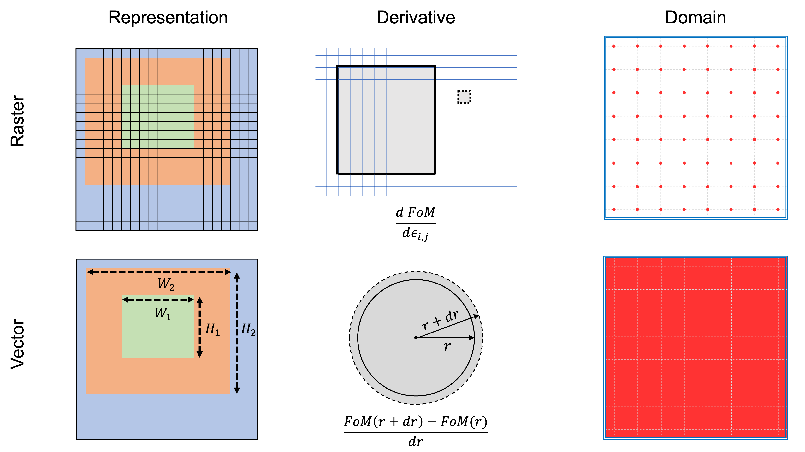

Geometry
========

In order to simulate real-world phenomena, it is important to faithfully replicate them within a computational environment. In this context, geometries, or device structures, must be transferred and modeled to facilitate the execution of virtual experiments through simulation.

    Figure 1: **Characteristics of each modeling type.**
    *Representation* An illustration of how the geometry is formed by each method.
    *Derivative* A schematic diagram highlighting the difference between the topological derivative (top) and
    shape derivative (bottom).
    *Domain* The area enclosed by the blue double line denotes the codomain, while the red dots on the left and
    red area on right represent the range.Two-dimensional grating layers and incident ray.

Meent offers support for two modeling types: raster and vector. Analogous to the image file format,
raster-type represents data as an array, while vector-type utilizes a set of objects, with each object comprising
vertices and edges, as shown in Figure 1.

Due to their distinct formats, each method employs different algorithms for space transformation,
resulting in different types of geometry derivatives, including topological and shape derivatives,
as depicted in Figure 1.
The topological derivative yields the gradient with respect to the permittivity changes of every cell in the grid,
while the shape derivative provides the gradient with respect to the deformations of a shape.

These two modeling methods have distinct advantages and are suited to different applications - raster for
freeform metasurface design and vector for optical critical dimension (OCD) metrology.
Freeform metasurface design is the realm of device optimization that typically using raster-type representation
consisting of two materials.
The process involves iteratively altering the material of individual cells to find the optimal structure,
where gradients may help effectively determining which cell to modify.

The conventional method for gradient computation in raster type is the adjoint method :cite:`park2022free-jlabreview`.
In the context of RCWA, this method entails two simulations with field reconstruction.
Conversely, utilizing Meent entails a single simulation and subsequent backpropagation, rendering it more cost-effective.
Additionally, AD serves as the only solution for calculating gradients in certain applications, such as
meta color router :cite:`kim2023design`, where defining adjoint source is not feasible.

OCD involves estimating the dimensions of specific design parameters, such as width or height of a rectangle,
aligning naturally with vector-type and shape derivative.
Using raster in this scenario severely limits the resolution of the parameters due to its discretized representation.
In mathematical terms, raster operates in a discrete space, whereas vector operates in a continuous space,
as illustrated in Figure 1.

----

.. bibliography::
   :filter: docname in docnames
